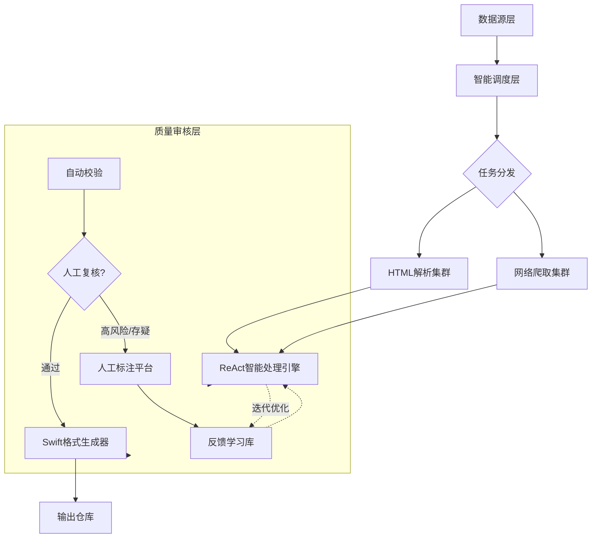

```mermaid
flowchart TD
    A[数据源层] --> B[智能调度层]
    B --> C{任务分发}
    C --> D[HTML解析集群]
    C --> E[网络爬取集群]
    D & E --> F[ReAct智能处理引擎]
    F --> G[质量审核层]
    G --> H[Swift格式生成器]
    H --> I[输出仓库]
    
    subgraph G [质量审核层]
        G1[自动校验] --> G2{人工复核?}
        G2 -- 高风险/存疑 --> G3[人工标注平台]
        G3 --> G4[反馈学习库]
        G4 -.-> F
        G2 -- 通过 --> H
    end
    
    F -.->|迭代优化| G4
```
