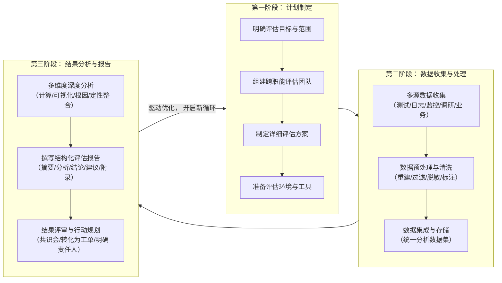

```mermaid
graph LR
    A[5.3.1 评估计划制定] --> B[5.3.2 数据收集与处理]
    B --> C[5.3.3 结果分析与报告]
    C -- 驱动优化， 开启新循环 --> A

    subgraph A [第一阶段： 计划制定]
        A1[明确评估目标与范围] --> A2[组建跨职能评估团队]
        A2 --> A3[制定详细评估方案]
        A3 --> A4[准备评估环境与工具]
    end

    subgraph B [第二阶段： 数据收集与处理]
        B1[多源数据收集<br>（测试/日志/监控/调研/业务）] --> B2[数据预处理与清洗<br>（重建/过滤/脱敏/标注）]
        B2 --> B3[数据集成与存储<br>（统一分析数据集）]
    end

    subgraph C [第三阶段： 结果分析与报告]
        C1[多维度深度分析<br>（计算/可视化/根因/定性整合）] --> C2[撰写结构化评估报告<br>（摘要/分析/结论/建议/附录）]
        C2 --> C3[结果评审与行动规划<br>（共识会/转化为工单/明确责任人）]
    end
```