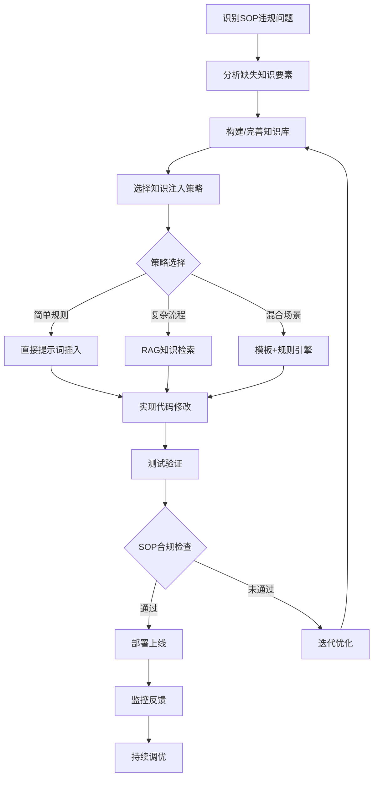

```mermaid
graph TD
    A[识别SOP违规问题] --> B[分析缺失知识要素]
    B --> C[构建/完善知识库]
    C --> D[选择知识注入策略]
    D --> E{策略选择}
    
    E -->|简单规则| F[直接提示词插入]
    E -->|复杂流程| G[RAG知识检索]
    E -->|混合场景| H[模板+规则引擎]
    
    F --> I[实现代码修改]
    G --> I
    H --> I
    
    I --> J[测试验证]
    J --> K{SOP合规检查}
    K -->|通过| L[部署上线]
    K -->|未通过| M[迭代优化]
    M --> C
    
    L --> N[监控反馈]
    N --> O[持续调优]
```
