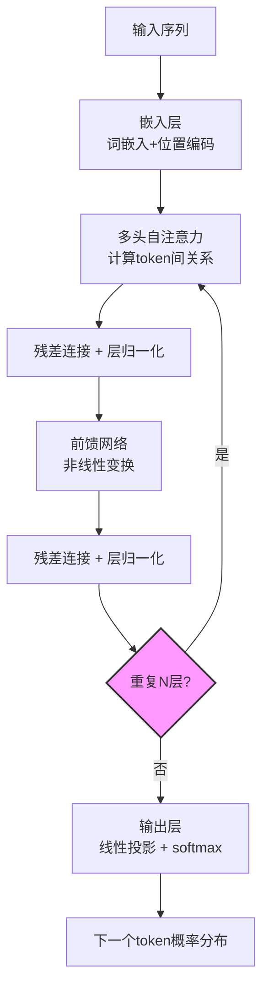

```mermaid
graph TD
    A[输入序列] --> B[嵌入层<br/>词嵌入+位置编码]
    B --> C[多头自注意力<br/>计算token间关系]
    C --> D[残差连接 + 层归一化]
    D --> E[前馈网络<br/>非线性变换]
    E --> F[残差连接 + 层归一化]
    F --> G{重复N层?}
    G -- 是 --> C
    G -- 否 --> H[输出层<br/>线性投影 + softmax]
    H --> I[下一个token概率分布]
    
    style G fill:#f9f,stroke:#333,stroke-width:2px
```
