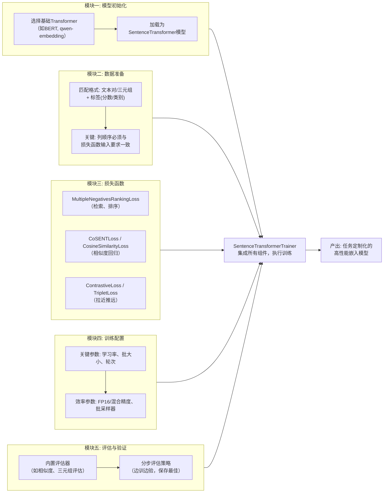

```mermaid
flowchart LR
    subgraph A [模块一: 模型初始化]
        direction LR
        A1["选择基础Transformer<br/>（如BERT, qwen-embedding）"]
        A2["加载为SentenceTransformer模型"]
        A1 --> A2
    end

    subgraph B [模块二: 数据准备]
        direction TB
        B1["匹配格式: 文本对/三元组<br/>+ 标签(分数/类别)"]
        B2["关键: 列顺序必须与<br/>损失函数输入要求一致"]
        B1 --> B2
    end

    subgraph C [模块三: 损失函数]
        direction LR
        C1["MultipleNegativesRankingLoss<br/>（检索、排序）"]
        C2["CoSENTLoss / CosineSimilarityLoss<br/>（相似度回归）"]
        C3["ContrastiveLoss / TripletLoss<br/>（拉近推远）"]
    end

    subgraph D [模块四: 训练配置]
        direction TB
        D1["关键参数: 学习率、批大小、轮次"]
        D2["效率参数: FP16/混合精度、批采样器"]
        D1 --> D2
    end

    subgraph E [模块五: 评估与验证]
        direction LR
        E1["内置评估器<br/>（如相似度、三元组评估）"]
        E2["分步评估策略<br/>（边训边验，保存最佳）"]
        E1 --> E2
    end

    A --> F["SentenceTransformerTrainer<br/>集成所有组件，执行训练"]
    B --> F
    C --> F
    D --> F
    E --> F
    
    F --> G["产出: 任务定制化的<br/>高性能嵌入模型"]

```