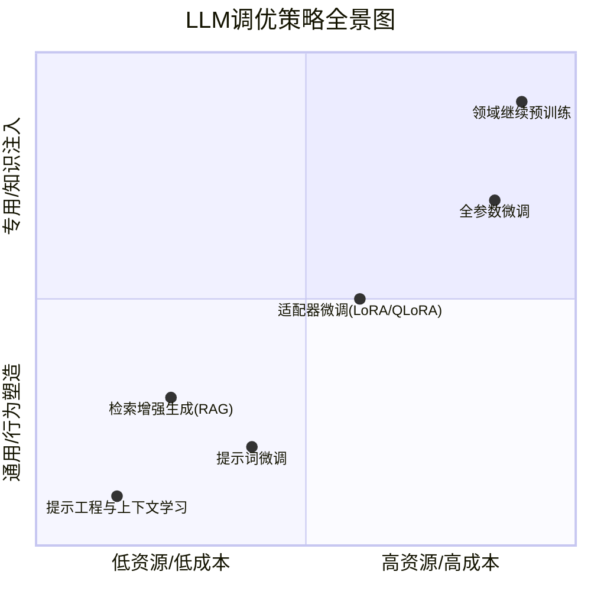

```mermaid
quadrantChart
    title LLM调优策略全景图
    x-axis "低资源/低成本" --> "高资源/高成本"
    y-axis "通用/行为塑造" --> "专用/知识注入"
    "提示工程与上下文学习": [0.15, 0.1]
    "检索增强生成(RAG)": [0.25, 0.3]
    "提示词微调": [0.4, 0.2]
    "适配器微调(LoRA/QLoRA)": [0.6, 0.5]
    "全参数微调": [0.85, 0.7]
    "领域继续预训练": [0.9, 0.9]
```
